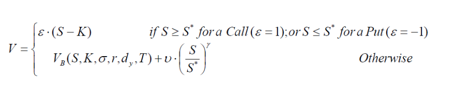
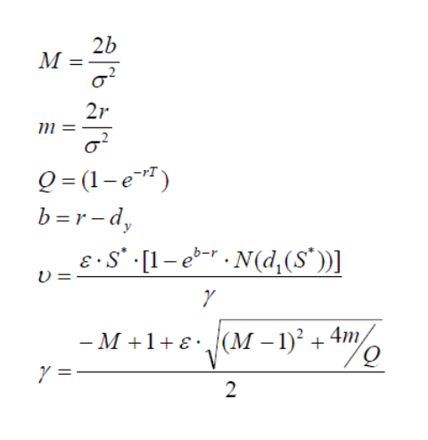
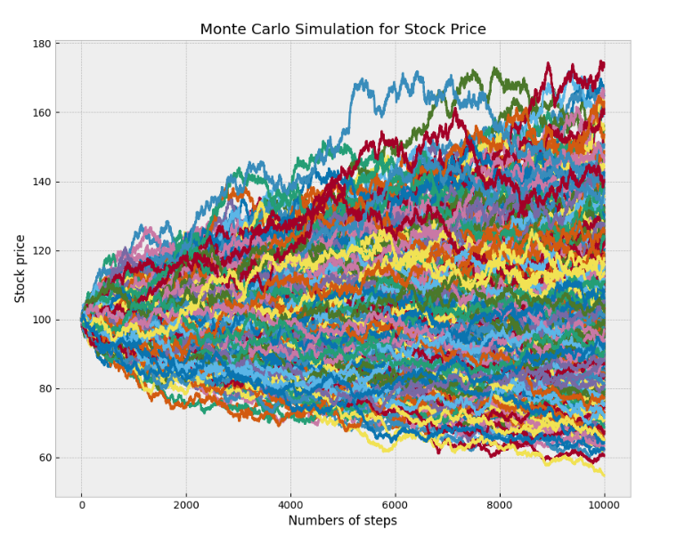

# Options Trading Bot

This project is an options trading bot for standard American stock options that uses advanced models and techniques to make profitable trades in both low and high volatility markets. The bot is designed to be flexible, efficient, and easy to deploy and maintain.

## Models

### Barone-Adesi and Whaley Pricing Model

The Barone-Adesi and Whaley model is ananalytical approximation method for pricing American options and was introduced as an extension of the Black-Scholes model, aiming to account for the early exercise premium of American options.

The value of the trade is given by:

where:

Reference: https://assets.pubpub.org/or0zyxly/21654278914381.pdf

The BAW model uses a quadratic approximation to the early exercise boundary, which allows for a closed-form solution for the option price. This makes the model computationally efficient and suitable for pricing American options on non-dividend-paying stocks and indices.
In low volatility environments, the BAW model is known to perform well for several reasons:

1. **Accuracy**: The quadratic approximation used in the BAW model works particularly well when the early exercise premium is small, which is typically the case in low volatility markets. The model's accuracy in these conditions is generally comparable to more computationally intensive numerical methods.
2. **Computational Efficiency**: The closed-form solution of the BAW model makes it computationally efficient, allowing for fast pricing and easy integration into trading systems or real-time applications.
3. **Stability**: The model's behavior is relatively stable in low volatility regimes, providing consistent and reliable pricing results.

However, it's important to note that the BAW model can become less accurate in high volatility environments or when the underlying asset pays significant dividends. In such cases, alternative methods like binomial trees or Monte Carlo simulations may be more appropriate.

### Monte Carlo Simulations

Monte Carlo simulations are a computational technique used to estimate the value of an option or other derivative by simulating the future behavior of the underlying asset. This method is particularly useful in high volatility environments where analytical models may struggle to accurately capture the complexities of the market dynamics.

Example of Monte Carlo Simulations for Standard Stock Price (Not Options):

Reference: https://www.tejwin.com/en/insight/options-pricing-with-monte-carlo-simulation/

In a Monte Carlo simulation for option pricing, the following steps are typically followed:
1. **Generate Random Paths**: A large number of possible future price paths for the underlying asset are generated using random variables and a stochastic process model (e.g., Geometric Brownian Motion).
2. **Calculate Payoffs**: For each simulated price path, the payoff of the option is calculated at the expiration date based on the contractual terms.
3. **Discount and Average**: The payoffs from all simulated paths are discounted back to the present value using an appropriate risk-free rate, and the average of these discounted payoffs is taken as an estimate of the option's current fair value.

Monte Carlo simulations perform well in high volatility environments for several reasons:
1. **Flexibility**: Monte Carlo methods can handle a wide range of option styles, underlying asset dynamics, and path-dependent payoff structures, making them suitable for complex derivative products.
2. **Capture of Volatility Dynamics**: By simulating the underlying asset's price paths directly, Monte Carlo simulations can accurately capture the effects of high volatility, including jumps, stochastic volatility, and other non-standard dynamics.
3. **Convergence**: With a sufficiently large number of simulated paths, Monte Carlo simulations can converge to the true option value, providing reliable results even in highly volatile market conditions.

## Bot Implementation

The core functionality of the options trading bot is implemented in the `run_bot` function, which takes the following parameters:

- `ticker_symbol` (str): The ticker symbol of the stock to trade options on.
- `backtest` (bool, optional): Whether to run the bot in backtest mode. Default is `False`.
- `start_date` (str, optional): The start date of the backtest period (for backtesting purposes only).
- `end_date` (str, optional): The end date of the backtest period (for backtesting purposes only).
- `freq` (str, optional): The frequency of the data. Default is '1d' for daily data (for backtesting purposes only).

The `run_bot` function performs the following steps:

1. **Fetch Stock Data**: It fetches historical data for the specified stock using the `yfinance` library.
2. **Retrieve Option Chain**: It retrieves the option chain (calls and puts) for the stock using the `yfinance` library.
3. **Calculate Option Prices**: For each option in the chain, it calculates the theoretical option price using either the Barone-Adesi and Whaley (BAW) model for low volatility scenarios or Monte Carlo simulations for high volatility scenarios.
4. **Identify Trading Opportunities**: It compares the calculated option price with the market price and identifies potential trading opportunities based on a predefined significance level.
5. **Return Trading Signals**: The function returns a list of option contract symbols that represent potential trading opportunities.

The bot also incorporates risk management by utilizing the `manage_greeks` function from the `bot_management.greek_management` module. This function calculates and manages the Greeks (Delta, Gamma, Vega, Theta, and Rho) to adjust positions and hedge risk accordingly.

Additionally, the bot retrieves the 10-year U.S. Treasury yield from the FRED API to use as the risk-free rate for option pricing calculations.

## Backtesting Engine

The options trading bot includes a backtesting engine that allows you to evaluate the performance of your trading strategies on historical market data before deploying them in live markets. This feature is essential for testing and refining your strategies, assessing risk, and gaining confidence in your bot's performance.

The backtesting component is implemented in the `backtest_bot` function, which takes the following parameters:

- `symbol`: The ticker symbol of the underlying asset (e.g., 'AAPL' for Apple Inc.)
- `start_date`: The start date for the backtest period (e.g., '2023-01-01')
- `end_date`: The end date for the backtest period (e.g., '2023-12-31')
- `freq` (optional): The frequency of the data to be used for backtesting (e.g., '1d' for daily data)

The `backtest_bot` function downloads historical data for the specified asset and date range, runs the trading bot for each data point, and calculates various performance metrics, including:

- Total number of trades
- Number of winning trades
- Number of losing trades
- Total profit

These metrics provide valuable insights into the bot's performance and can help you fine-tune your strategies or adjust risk management parameters as needed.

## Risk Management with Greeks

Effective risk management is crucial in options trading, and this bot incorporates the calculation and utilization of Greeks to manage risk and adjust positions accordingly. The Greeks refer to a set of risk measures that describe the sensitivity of an option's price to various factors, such as the underlying asset's price, volatility, time to expiration, and interest rates.

The risk management component of the bot focuses on the following Greeks:

- **Delta**: Measures the sensitivity of an option's price to changes in the underlying asset's price.
- **Gamma**: Measures the rate of change in the option's delta.
- **Vega**: Measures the sensitivity of an option's price to changes in volatility.
- **Theta**: Measures the sensitivity of an option's price to the passage of time.
- **Rho**: Measures the sensitivity of an option's price to changes in interest rates.

The bot provides functions to manage each of these Greeks, allowing you to adjust your positions and hedge your risk accordingly. For example, the `manage_delta` function calculates the appropriate position size and hedge quantity based on your desired delta exposure and account size.

Similarly, the `manage_gamma`, `manage_vega`, `manage_theta`, and `manage_rho` functions help you manage your exposure to changes in volatility, time decay, and interest rates, respectively.

The `manage_greeks` function serves as a central point to set the values of the Greeks and adjust your positions based on your risk management preferences, such as maximum exposure levels for gamma and theta.

For detailed information on how to interpret the Greek values, please refer to [Greeks (Wikipedia)](https://en.wikipedia.org/wiki/Greeks_(finance)).

## Getting Started

Follow these steps to set up and run the options trading bot:

1. Clone the repository:
`git clone https://github.com/your-username/options-trading-bot.git`

2. Build the Docker image:
`docker build -t options-trading-bot .`

3. Run the Docker container:
`docker run -it options-trading-bot`

4. Configure the bot by modifying the `config.py` file with your desired settings, such as trading parameters, data sources, and broker credentials.

5. Run the bot:
`python bot.py`

## Contributing

Contributions are welcome! If you find any issues or want to enhance the project, please open an issue or submit a pull request.

## License

This project is licensed under the [MIT License](LICENSE).
